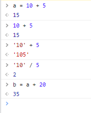

# **Лабораторная работа №2. Инструменты разработчика в браузере**
### **Задание №1. Исследование заголовков и тела обычных запросов и их ответов.**
1. **Что означает каждый из этих заголовков?**
- Request URL - Запрашиваемый URL (ссылка)
- Request Method - Запрашиваемый метод
- Status Code - Статус код запросов
- Remote Address - Удаленный адрес (IP- адрес)
- Referrer Policy - позволяет сайту контролировать значение заголовка Referer для ссылок, ведущих с вашей страницы.
- content-type - какой контент показывается  (изображение, гиф, текст и тд.)
- cache-control -  Сообщает, не является ли контент предназначенным для конкретного пользователя.
- Cookie - куки запросов 
- user-agent - программный элемент сайта, обозначающий человека, пользующийся им
- Referer - Источник запроса
1. **Из каких частей состоит Remote Address?** - Из IP и Порта.
1. **Что означает порт подключения?** — **опишите как вы это понимаете своими словами** - то число, которое записывается в заголовках протоколов. Оно используется для определения программы или процесса-получателя пакета в пределах одного IP-адреса.Порты позволяют определить сетевые приложения, работающие на компьютере, множество которых может быть запущено одновременно.
1. **На какие секции разделены все заголовки? Какой смысл у каждой секции?** - Основные заголовки применяется как к запросам, так и к ответам, но не имеет отношения к данным, передаваемым в теле. Заголовки запроса содержит больше информации о ресурсе, который нужно получить, или о клиенте, запрашивающем ресурс. Заголовки ответа(en-US) содержат дополнительную информацию об ответе, например его местонахождение, или о сервере, предоставившем его.Заголовки сущности содержат информацию о теле ресурса, например его длину содержимогоили тип MIME.

1. **Какие заголовки повторяются в нескольких секциях? Какой в этом смысл?** - повторяются content length и content type, повторяются они так как заголовки запроса и заголовки ответа отличаются выдаваемой информацией
1. **Что из себя представляет тело объекта?** - Весь код сайта (HTML)
### **Задание №2. Исследование указывающих ответов сервера.**

1. **Из-за чего произошло изменение адреса в адресной строке? Какие заголовки в этом поучаствовали и как?** - Изменение произошло из-за перенаправления которое происходит в случае неправильного написания протокола. При неправильном написании создается новый заголовок rgups.ru с ошибкой 301 который и перенаправляет пользователя. 
1. **Адрес был изменён в исходном запросе или потребовались дополнительные запросы, если были дополнительные запросы, то сколько?** - Появился один новый запрос с ошибкой 301 который перенаправил пользователя.
1. **Какой статус ответа имеет первоначальный запрос?** - Первоначальный статус запроса 200.
### **Задание №3. Исследование получения и передачи cookie.**
1. **Перечислите название этих параметров и формат данных в них.** - Set-Cookie и Cookie. В нашем случае set-cookie включается домен(domain)-.yandex.ru(URL?), путь(path)-path=/, дату когда куки будут удалены(expires)-дата и время. В cookie обычно записываются зашифрованные данные(набор букв цифр и спец. Символов)
1. **Как можно удобно просмотреть все cookie, используемые на странице? Что означают их параметры Name, Value, Domain, Path и Expires?** - В network открыть вкладку Cookies. Так эе файлы Cookies хранятся в директории браузера, которая расположена на системном диске по цепочке «Папка пользователя» – AppData – «Папка браузера» (Opera, Google Chrome, Yandex и так далее). Постоянные данные хранятся в специальном текстовом файле, расположенном в папке браузера. Так же можно просмотреть куки с помощью JavaScript выполнив  определенную команду. Параметр Name означает имя куки, Value - числовое значение куки, Domain - указывает на хосты которые отсылаются куки, path - указывает URL, который должен быть в запрашиваемом ресурсе на момент отправки заголовка.
1. **Как просмотреть все cookie связанные с текущим (просматриваемым) сайтом?** - во вкладке сети (network) есть специальный раздел Cookie в котором хранятся все куки просматриваемого сайта.
1. **Опишите своими словами как вы понимаете суть и назначение cookie?** - это небольшие пакеты данных которые отправляются сервером и хранящиеся на компьютере пользователя. С помощью куки сайт запоминает информации о ваших посещениях, чтобы в следующий раз пользователю не пришлось снова вводить информацию которую он когда - либо вводил.
### **Задание №4. Исследование построения документов и сопутствующих запросов.**

1. **Что такое DOM? — Опишите своими словами -** по сути DOM - это код написанный вами в панели разработчика.
1. **Может ли итоговый документ отличаться от тела ответа, полученного от сервера? Если да, то по каким причинам это может происходить?** - Да, итоговый документ может отличаться от тела ответа с помощью пользователя который может изменять параметры по своему усмотрению, но при обновлении страницы все изменени будут потеряны и страница вернется в первоначальный вид.
1. **Почему если вы сделали всего один запрос, в списке огромное количество запросов и ответов?** **Что они из себя представляют и на каком основании браузер их делает? -** Когда вы заходите на сайт у вас сразу загружается множество запросов каждый из которых отвечает за что-то свое, например множество запросов отвечают за изображения которые вы видете, некоторые связываются с кодом JS и CSS. Браузер делает это для видимой вами загруженной страницы, иначе не все элементы страницы будут отображены.
### **Задание №5. Исполнение кода в консоли. Использование консоли для отладки.**

Откройте вкладку Console и попробуйте выполнить в ней простейшие арифметические операции в синтаксисе JavaScript.

